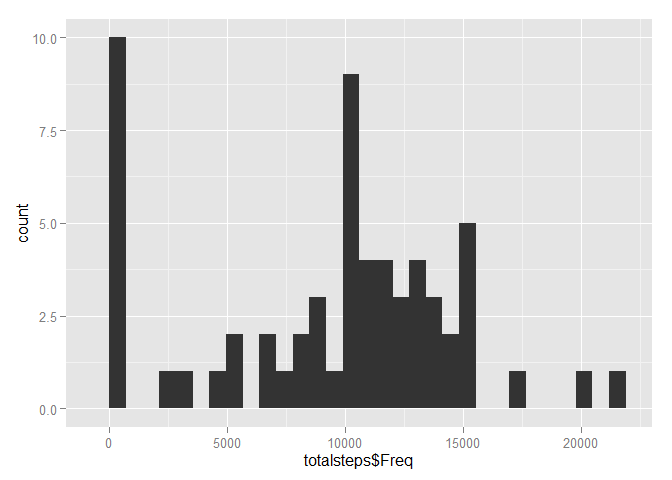
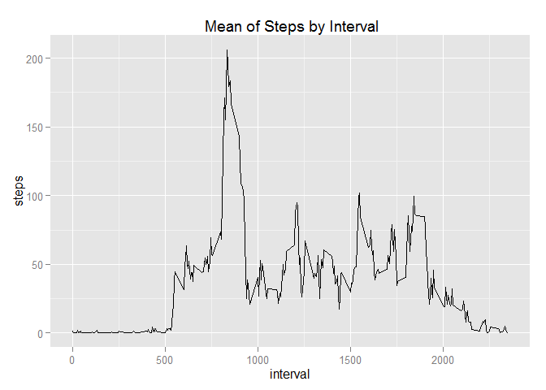
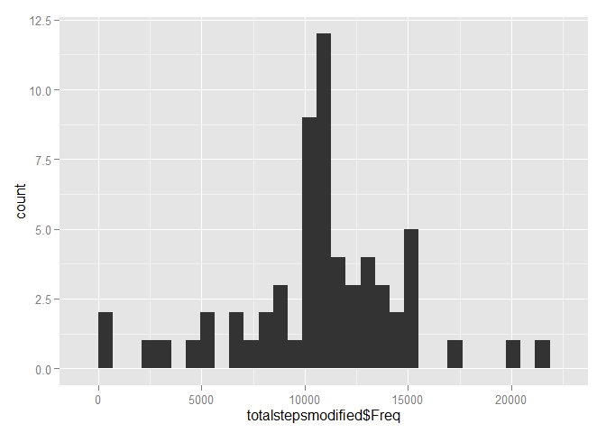
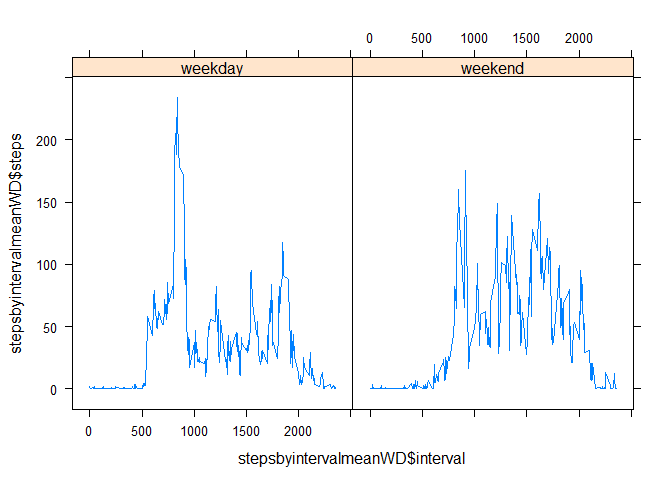

# Reproducible Research: Peer Assessment 1


## Loading and preprocessing the data


```r
data <- read.csv("activity.csv")
```

## Calculate the total number of steps taken per day and show on a histogram


```r
totalsteps <- as.data.frame(xtabs(steps ~ date, data))
library(ggplot2)
qplot(totalsteps$Freq, geom="histogram") 
```

 


The mean of the total number of steps taken per day is **9354.2295082** calculated with *mean(totalsteps$Freq)*  

The median of the total number of steps taken per day is **1.0395\times 10^{4}** calculated with *median(totalsteps$Freq)*

# The average daily activity pattern  


```r
stepsbyintervalmean <- aggregate(steps ~ interval, data, mean)
qplot(interval, steps, data = stepsbyintervalmean, geom = "line", main = " Mean of Steps by Interval")
```

 

5-minute interval, on average across all the days in the dataset, contains the maximum number of steps **835 - 840**
calculated with
*stepsbyintervalmean[which.max(stepsbyintervalmean[,2]),1] and stepsbyintervalmean[(which.max(stepsbyintervalmean[,2])+1),1]*

# Imputing missing values
The total number of missing values in the dataset is **2304**
calculated with *sum(!complete.cases(data))*

A new dataset that is equal to the original dataset but with the missing data filled in

```r
colnames(stepsbyintervalmean)[2] <- "stepsmean"
mergeddata <- merge(data, stepsbyintervalmean, by = "interval", all = TRUE, sort = FALSE)
for (i in 1:nrow(mergeddata) ) {
  if (is.na(mergeddata[i,2]))
    {mergeddata[i,2] <- mergeddata[i,4] }
}
```


```r
totalstepsmodified <- as.data.frame(xtabs(steps ~ date, mergeddata))
library(ggplot2)
qplot(totalstepsmodified$Freq, geom="histogram") 
```

 

The mean of the total number of steps taken per day where NAs are replaced by mean is **1.0766189\times 10^{4}** calculated with *mean(totalstepsmodified$Freq)*  

The median of the total number of steps taken per day where NAs are replaced by median is **1.0766189\times 10^{4}** calculated with *median(totalstepsmodified$Freq)*

The difference between the original and the replaced mean is **-1411.959171** calculated with *mean(totalsteps$Freq) - mean(totalstepsmodified$Freq)*

The difference between the original and the replaced median is **-371.1886792** calculated with *median(totalsteps$Freq) - median(totalstepsmodified$Freq)*

# Differences in activity patterns between weekdays and weekends


```r
for (i in 1:nrow(data) ) {
  if ((weekdays(as.Date(data[i,2])) == "szombat") | (weekdays(as.Date(data[i,2])) == "vasárnap")) 
    {data[i,4] <- "weekend"}
    else {
      data[i,4] <- "weekday"
    }
}
data$V4 <- as.factor(data$V4)
stepsbyintervalmeanWD <- aggregate(steps ~ interval + V4, data, mean)
```


```r
library(lattice)
xyplot(stepsbyintervalmeanWD$steps ~ stepsbyintervalmeanWD$interval | stepsbyintervalmeanWD$V4, panel = function(x, y, layout = c(1,2)) {panel.xyplot(x, y, type = "a")
})
```

 

